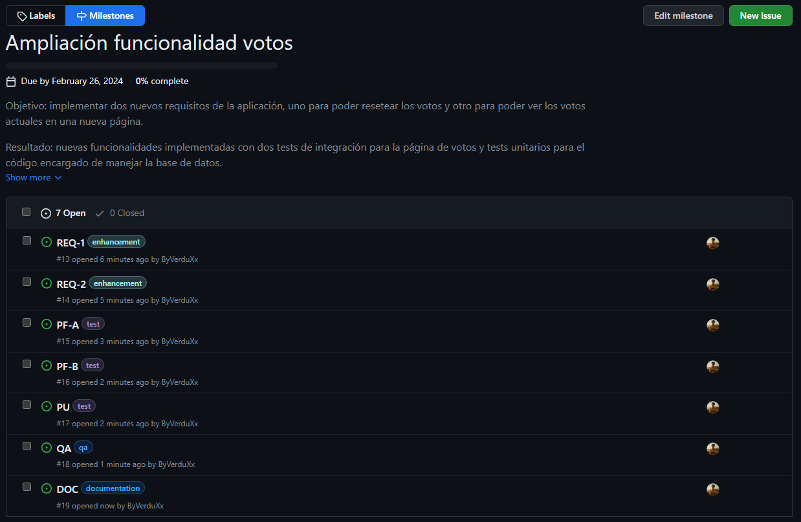
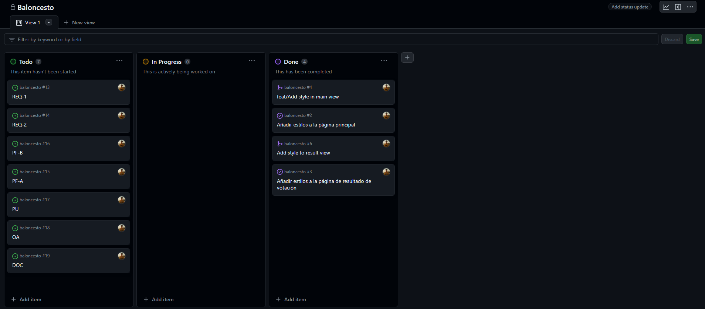
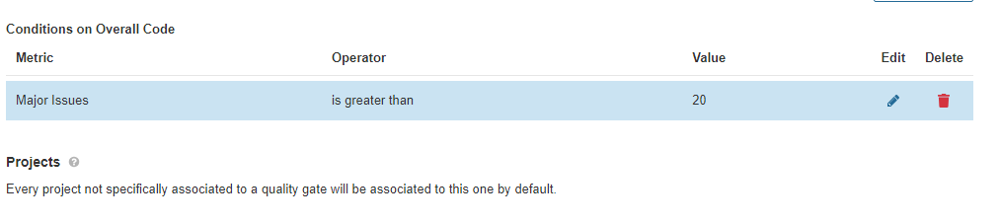
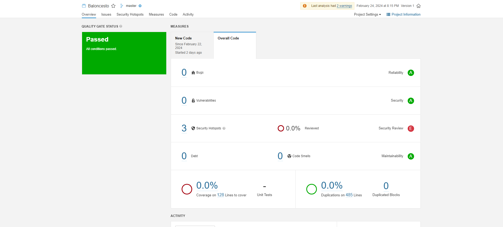
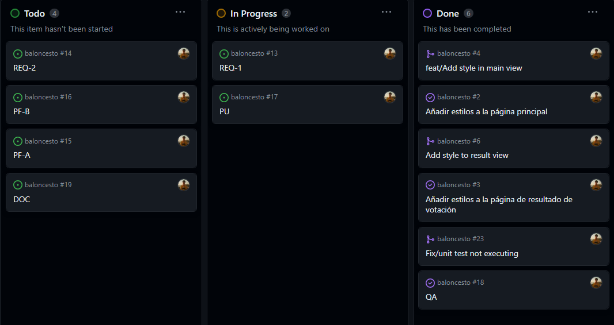
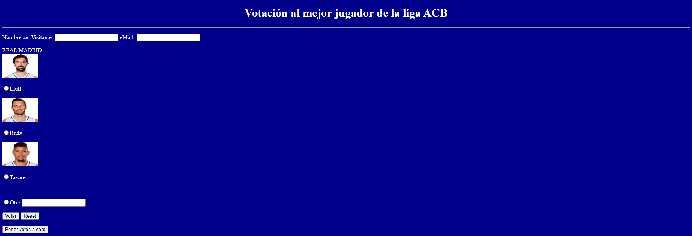
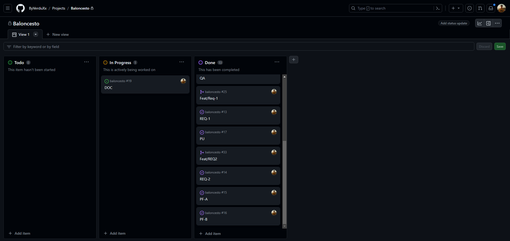
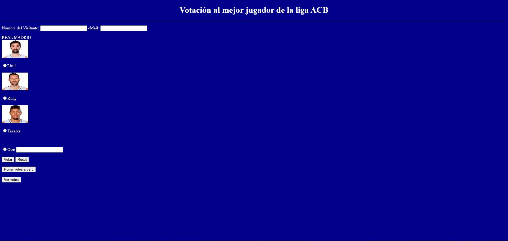
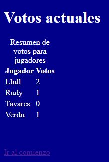
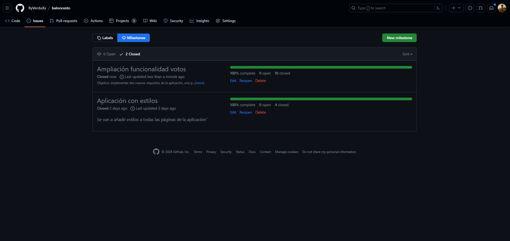

# Trabajo Final ICDA

## Índice

1. [Introducción](#1-introducción)
2. [Entorno de preproducción](#2-entorno-de-preproducción)
3. [Creación del milestone e issues](#3-creación-del-milestone-e-issues)
4. [Reducción de Major Issues](#4-reducción-de-major-issues)
5. [Desarrollo de las nuevas funcionalidades](#5-desarrollo-de-las-nuevas-funcionalidades)
   1. [REQ-1: Resetear votos](#51-req-1-resetear-votos)
   2. [REQ-2: Ver votos](#52-req-2-ver-votos)
6. [Conclusiones y cierre del milestone](#6-conclusiones-y-cierre-del-milestone)

## 1. Introducción

Se toma como punto de partida el final de la práctica de la unidad 5. Se han realizado las nuevas tareas para esta apicación, que son las siguientes:

- Crear un entorno de preproducción
- Reducir el QA a menos de 20 Major Issues
- Realizar los dos requisitos nuevos con respecto a los votos y sus respectivos tests

Todo esto se encuentra en el [repositorio de GitHub](https://github.com/ByVerduXx/baloncesto).

Los despliegues se encuentran en los siguientes enlaces:

- [Despliegue en preproducción](https://baloncesto-verdu-pre.azurewebsites.net/Baloncesto/index.html)
- [Despliegue en producción](https://baloncesto-verdu.azurewebsites.net/Baloncesto/)

El vídeo explicativo se encuentra [aquí](https://www.youtube.com/watch?v=Fa6jqt19FO0&ab_channel=VerduTech).

## 2. Entorno de preproducción

Se ha creado un entorno de preproducción en Azure, y se ha añadido al pipeline de despliegue.

```yaml
stage:
  runs-on: ubuntu-latest
  needs: qa
  if: github.ref == 'refs/heads/main'
  steps:
    - name: Descargar repositorio
      uses: actions/checkout@v3

    - name: Crear el archivo .war
      run: |
        mvn package -DskipTests=true
    - name: Aprobación manual
      uses: trstringer/manual-approval@v1
      with:
        secret: ${{ secrets.TOKEN }}
        approvers: ByVerduXx

    - name: Desplegar en Azure
      uses: Azure/webapps-deploy@v2
      with:
        app-name: baloncesto-verdu-pre
        publish-profile: ${{ secrets.AZURE_WEBAPP_PUBLISH_PROFILE_STAGE }}
        package: target/*.war
```

Esta configuración aplica la misma lógica que la configuyración de despliegue en producción, pero con un nombre de aplicación distinto y un token distinto.

Para crear este nuevo token, después de haber creado la aplicación en Azure, se debe ir a la sección de configuración de la aplicación, y en la sección de "Publicación Continua" se puede crear un nuevo perfil de publicación. Este perfil de publicación se debe añadir como un secreto en el repositorio de GitHub.

El token se añade en la sección de "Secretos" del repositorio, llamándose `AZURE_WEBAPP_PUBLISH_PROFILE_STAGE`.

Nótese que ahora, el trabajo de stage depende del trabajo de qa, por lo que se añade la línea `needs: qa`, y el trabajo de producción depende del trabajo de stage, por lo que se añade la línea `needs: stage`.

Ahora, al subir este cambio al repositorio, en el apartado de "Acciones" de GitHub, se puede ver que se ha añadido un nuevo trabajo, llamado "Stage", que se ejecuta después de que se haya ejecutado el trabajo de "QA". Además, al igual que el de produccióm, este trabajo se ejecuta solo si se ha hecho un push a la rama main y es aceptado manualmente.

## 3. Creación del milestone e issues

Se ha creado un nuevo milestone llamado "Amplicación funcionalidad Votos" y todas las tareas necesarias se han añadido en forma de issues.

Cada una de estas issues ha sido anotada correctamente con una etiqueta para tener más orden sobre ellas. Por ejemplo, distinguiendo tareas de test, de desarrollo, etc.



Como vemos, a parte de las necesarias se ha creado una issue para reflejar la creación de la documentación, en este caso, esta misma y el vídeo.

Después de esto, el kanban se ve de la siguiente manera:



## 4. Reducción de Major Issues

Para comenzar con el milestone, antes de realizar las tareas de desarrollo, se ha reducido el número de Major Issues permitidas 20. Para ello, se ha ido a Sonar, al apartado de "Quality Gates", y se ha modificado el número de Major Issues permitidas.



Posteriormente, en la sección de "Issues", aparecen todas las issues que se deben resolver para que el número de Major Issues sea menor a 20. En mi caso, resolví todas las issues para dejarlo perfecto. No cerré la tarea de QA hasta que no se resolvieron todas las issues, y eso fue hasta el final del desarrollo. El resultado es el siguiente:



En el vídeo se explica con más detalle qué tipo de issues se han resuelto a lo largo del desarrollo.

## 5. Desarrollo de las nuevas funcionalidades

Se han desarrollado las dos nuevas funcionalidades que se pedían en el milestone. Esta tarea se ha realizando utilizando diferentes ramas para cada una de las funcionalidades, y se han hecho los respectivos tests para cada una de ellas.

### 5.1. REQ-1: Resetear votos

Se ha creado una nueva funcionalidad que permite resetear los votos de los equipos. Para ello, se ha añadido un nuevo botón en la página principal, que permite resetear los votos.

El primer paso ha sido ir al tablero Kanban y desplazar a la columna "In Progress" la issue correspondiente a esta tarea, junto con la issue de test.



Nota, en la imagen aparece la tarea de QA como cerrada, pero la volví a abrir para poder cerrarla al final del desarrollo, reduciendo las issues a cero.

Después de hacer los cambios de código correspondientes, que se ven más detalladamente en el vídeo, comprobamos el pipeline de despliegue. Tras unos pequeños ajustes, el pipeline se ejecuta correctamente, y se puede aprobar en el entorno de preproducción.

Una vez finalizado el desarrollo, se cierran las issues correspondientes, y se desplazan a la columna "Done" del tablero Kanban. El resultado es el siguiente:



### 5.2. REQ-2: Ver votos

Se ha creado una nueva funcionalidad que permite ver los votos de los equipos. Para ello, se ha añadido un nuevo botón en la página principal, que permite ver los votos.

El primer paso ha sido ir al tablero Kanban y desplazar a la columna "In Progress" la issue correspondiente a esta tarea, junto con las issue de test.

En este caso se desplazaron las 3 issues restantes excepto la de documentación.

Después de hacer los cambios de código correspondientes, que se ven más detalladamente en el vídeo, comprobamos el pipeline de despliegue. Tras unos pequeños ajustes de nuevo (no todo sale perfecto a la primera), el pipeline se ejecuta correctamente, y se puede aprobar en el entorno de preproducción y producción.

Una vez finalizado el desarrollo, se cierran las issues correspondientes, y se desplazan a la columna "Done" del tablero Kanban.



El resultado final de la aplicación es el siguiente:



La visualización de votos:



En este punto está la aplicación subida a producción y disponible para su uso.

## 6. Conclusiones y cierre del milestone

Una vez finalizadas todas las tareas y llegados a este punto de la documentación, se ha cerrado la tarea de DOC y se ha cerrado el milestone.


